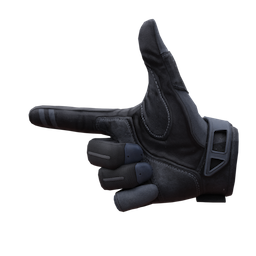
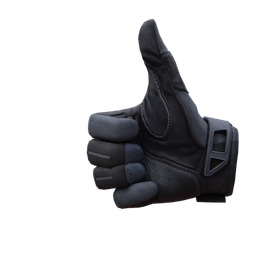
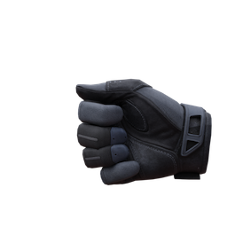
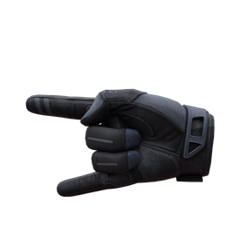

# Welcome to VR Sign Language Dictionary

This is an attempt to create the dictionary of VR American (VR-ASL) and VR Japanese Sign Language (VR-JSL). You can use this dictionary for references only.

A couple words of warning:

* If something here is documented incorrectly, please click the GitHub logo on top left of the page. Then, report the issue or submit pull request containing corrections.
* Please don't serve this as an authority on sign languages. **Instead, if a trusted member of the Deaf / HoH community tells you otherwise, pay attention to them over what is documented here.**
* This dictionary is still a work in progress. A lot or some things will be changed in the future.

This dictionary is managed by a team of editors from Deaf / HoH community in VRChat. Anyone can contribute by using issues and pull requests fuctions on GitHub.

Current editors:

* Amarante
* Rafael
* ZadeTheCheetah

Disclaimer: Some of stuff here is based on and/or copied from Devon's Sign Language resource website. [[Link]](https://vrsl.withdevon.xyz)

---

In VRChat, there are two main things that affect how you use sign languages in VR: **controller type** and **dominant hand**. Your controllers dicate the kind of gestures you can perform, and how they are displayed in-game. Your dominant hand changes which hand you use for each part of a sign. There are only eight hand gestures in-game.

The following eight gestures look like those:

(Idle, Open, Victory, Point, Finger Gun, Thumbs Up, Fist, Rock 'n' Roll)

Check tabs below (click each tab to see contents inside them) to see what your controllers look like for using gestures in VRChat.

<!-- tabs:start -->

#### **Meta**

(Idle, Open, Victory, Point, Finger Gun, Thumbs Up, Fist, Rock 'n' Roll)

#### **Vive**

#### **Index**

<!-- tabs:end -->